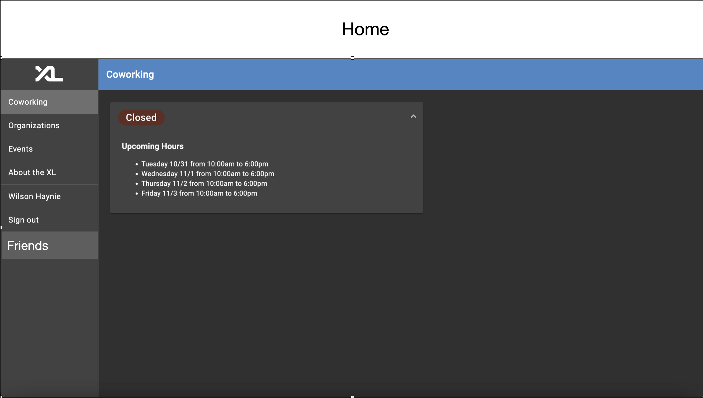
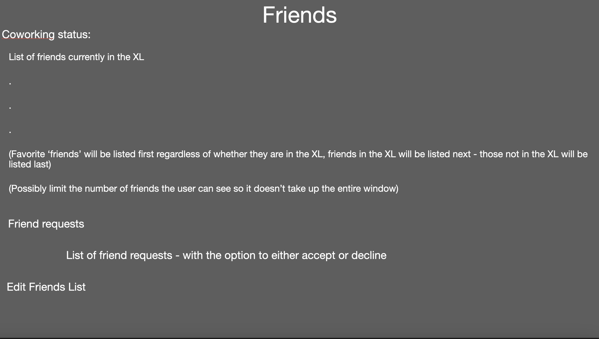
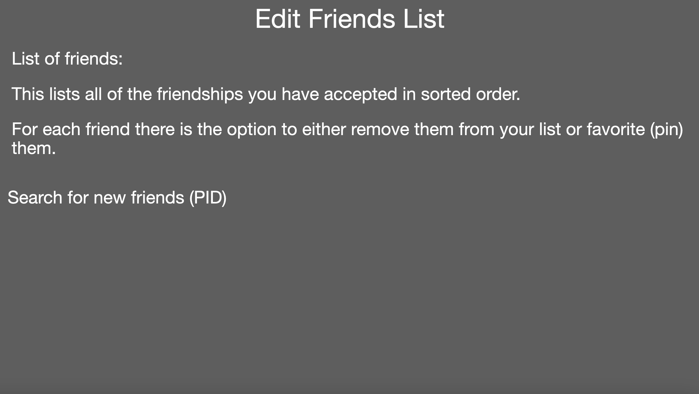

# Friendship System XML

### Authors: Amit Garine, Jasper Ou, Wilson Haynie, Nikhil Sarin

## Overview

This feature will allow students to connect with and make friends within other students/peers in the CS program. Students can send friend requests to other students. The student receiving the friend request can accept/decline the request and if they are already friends the student can unadd the friend as well. Once friendship connections are established, students can identify which friends are currently available at the XL coworking space and where they're seated. This system will make the overall experience of group study and collaboration more seamless and efficient.

## Key Personas

**Sally Student**
**Persona Description** Sally is a student and wants to friend request her peers in the computer science program and be able to see which students are checked into the XL and where they are sitting at. Sally's main needs and goals of this feature are to be able to connect with other students and find out when and where they will be in the XL and possibly collaborate with them on various projects and assignments. She also wants to be able to remove friends from her friend list.

## User Stories

**Story A**
As Sally Student, I want to be able to send friends requests to my peers and see a list of all of my friends.

**Story B**
As Sally Student, I want to be notified of when someone else friends me and have the option to accept/reject pending requests.

**Story C**
As Sally Student, I want to be able to view which of my friends are already checked into the XL. This way, I will be able to see who is currently working in the XL.

**Story D**
As Sally Student, I want to have option to see where my friends are sitting. This way, I can easily find them.

